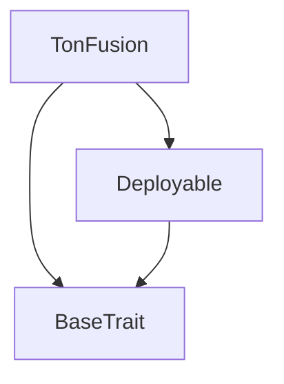

# Tact compilation report
Contract: TonFusion
BoC Size: 4607 bytes

## Structures (Structs and Messages)
Total structures: 38

### DataSize
TL-B: `_ cells:int257 bits:int257 refs:int257 = DataSize`
Signature: `DataSize{cells:int257,bits:int257,refs:int257}`

### SignedBundle
TL-B: `_ signature:fixed_bytes64 signedData:remainder<slice> = SignedBundle`
Signature: `SignedBundle{signature:fixed_bytes64,signedData:remainder<slice>}`

### StateInit
TL-B: `_ code:^cell data:^cell = StateInit`
Signature: `StateInit{code:^cell,data:^cell}`

### Context
TL-B: `_ bounceable:bool sender:address value:int257 raw:^slice = Context`
Signature: `Context{bounceable:bool,sender:address,value:int257,raw:^slice}`

### SendParameters
TL-B: `_ mode:int257 body:Maybe ^cell code:Maybe ^cell data:Maybe ^cell value:int257 to:address bounce:bool = SendParameters`
Signature: `SendParameters{mode:int257,body:Maybe ^cell,code:Maybe ^cell,data:Maybe ^cell,value:int257,to:address,bounce:bool}`

### MessageParameters
TL-B: `_ mode:int257 body:Maybe ^cell value:int257 to:address bounce:bool = MessageParameters`
Signature: `MessageParameters{mode:int257,body:Maybe ^cell,value:int257,to:address,bounce:bool}`

### DeployParameters
TL-B: `_ mode:int257 body:Maybe ^cell value:int257 bounce:bool init:StateInit{code:^cell,data:^cell} = DeployParameters`
Signature: `DeployParameters{mode:int257,body:Maybe ^cell,value:int257,bounce:bool,init:StateInit{code:^cell,data:^cell}}`

### StdAddress
TL-B: `_ workchain:int8 address:uint256 = StdAddress`
Signature: `StdAddress{workchain:int8,address:uint256}`

### VarAddress
TL-B: `_ workchain:int32 address:^slice = VarAddress`
Signature: `VarAddress{workchain:int32,address:^slice}`

### BasechainAddress
TL-B: `_ hash:Maybe int257 = BasechainAddress`
Signature: `BasechainAddress{hash:Maybe int257}`

### Deploy
TL-B: `deploy#946a98b6 queryId:uint64 = Deploy`
Signature: `Deploy{queryId:uint64}`

### DeployOk
TL-B: `deploy_ok#aff90f57 queryId:uint64 = DeployOk`
Signature: `DeployOk{queryId:uint64}`

### FactoryDeploy
TL-B: `factory_deploy#6d0ff13b queryId:uint64 cashback:address = FactoryDeploy`
Signature: `FactoryDeploy{queryId:uint64,cashback:address}`

### LockJetton
TL-B: `lock_jetton#f512f7df orderConfig:OrderConfig{id:uint32,srcJettonAddress:address,senderPubKey:address,receiverPubKey:address,hashlock:uint256,timelock:uint32,amount:uint64,finalized:bool,partialFills:dict<uint256, uint64>,totalFilled:uint64,direction:uint8} jetton:^cell customPayload:Maybe ^cell = LockJetton`
Signature: `LockJetton{orderConfig:OrderConfig{id:uint32,srcJettonAddress:address,senderPubKey:address,receiverPubKey:address,hashlock:uint256,timelock:uint32,amount:uint64,finalized:bool,partialFills:dict<uint256, uint64>,totalFilled:uint64,direction:uint8},jetton:^cell,customPayload:Maybe ^cell}`

### CreateOrder
TL-B: `create_order#7362d09c orderConfig:Order{id:uint32,srcJettonAddress:address,senderPubKey:address,hashlock:uint256,timelock:uint32,amount:uint64,finalized:bool,partialFills:dict<uint256, uint64>,totalFilled:uint64,direction:uint8} jetton:^cell customPayload:Maybe ^cell = CreateOrder`
Signature: `CreateOrder{orderConfig:Order{id:uint32,srcJettonAddress:address,senderPubKey:address,hashlock:uint256,timelock:uint32,amount:uint64,finalized:bool,partialFills:dict<uint256, uint64>,totalFilled:uint64,direction:uint8},jetton:^cell,customPayload:Maybe ^cell}`

### CreateEVMToTONOrder
TL-B: `create_evm_to_ton_order#8b341822 orderConfig:OrderConfig{id:uint32,srcJettonAddress:address,senderPubKey:address,receiverPubKey:address,hashlock:uint256,timelock:uint32,amount:uint64,finalized:bool,partialFills:dict<uint256, uint64>,totalFilled:uint64,direction:uint8} evmContractAddress:address customPayload:Maybe ^cell = CreateEVMToTONOrder`
Signature: `CreateEVMToTONOrder{orderConfig:OrderConfig{id:uint32,srcJettonAddress:address,senderPubKey:address,receiverPubKey:address,hashlock:uint256,timelock:uint32,amount:uint64,finalized:bool,partialFills:dict<uint256, uint64>,totalFilled:uint64,direction:uint8},evmContractAddress:address,customPayload:Maybe ^cell}`

### CreateTONToEVMOrder
TL-B: `create_ton_to_evm_order#62239978 orderConfig:OrderConfig{id:uint32,srcJettonAddress:address,senderPubKey:address,receiverPubKey:address,hashlock:uint256,timelock:uint32,amount:uint64,finalized:bool,partialFills:dict<uint256, uint64>,totalFilled:uint64,direction:uint8} targetChainId:uint32 customPayload:Maybe ^cell = CreateTONToEVMOrder`
Signature: `CreateTONToEVMOrder{orderConfig:OrderConfig{id:uint32,srcJettonAddress:address,senderPubKey:address,receiverPubKey:address,hashlock:uint256,timelock:uint32,amount:uint64,finalized:bool,partialFills:dict<uint256, uint64>,totalFilled:uint64,direction:uint8},targetChainId:uint32,customPayload:Maybe ^cell}`

### PartialFill
TL-B: `partial_fill#4ef5cb26 orderHash:uint256 secret:uint256 fillAmount:uint64 resolver:address customPayload:Maybe ^cell = PartialFill`
Signature: `PartialFill{orderHash:uint256,secret:uint256,fillAmount:uint64,resolver:address,customPayload:Maybe ^cell}`

### CompletePartialFill
TL-B: `complete_partial_fill#8b341823 orderHash:uint256 secret:uint256 customPayload:Maybe ^cell = CompletePartialFill`
Signature: `CompletePartialFill{orderHash:uint256,secret:uint256,customPayload:Maybe ^cell}`

### DeployEscrow
TL-B: `deploy_escrow#595f07bc chainId:uint32 targetAddress:address customPayload:Maybe ^cell = DeployEscrow`
Signature: `DeployEscrow{chainId:uint32,targetAddress:address,customPayload:Maybe ^cell}`

### EscrowDeployed
TL-B: `escrow_deployed#7bdd97de chainId:uint32 contractAddress:address success:bool customPayload:Maybe ^cell = EscrowDeployed`
Signature: `EscrowDeployed{chainId:uint32,contractAddress:address,success:bool,customPayload:Maybe ^cell}`

### RegisterRelayer
TL-B: `register_relayer#7362d09e relayer:address customPayload:Maybe ^cell = RegisterRelayer`
Signature: `RegisterRelayer{relayer:address,customPayload:Maybe ^cell}`

### UpdateRelayerStats
TL-B: `update_relayer_stats#7362d09f relayer:address success:bool customPayload:Maybe ^cell = UpdateRelayerStats`
Signature: `UpdateRelayerStats{relayer:address,success:bool,customPayload:Maybe ^cell}`

### GetFund
TL-B: `get_fund#50635fd2 secret:uint256 hash:uint256 customPayload:Maybe ^cell = GetFund`
Signature: `GetFund{secret:uint256,hash:uint256,customPayload:Maybe ^cell}`

### Refund
TL-B: `refund#e49e1dcb hash:uint256 customPayload:Maybe ^cell = Refund`
Signature: `Refund{hash:uint256,customPayload:Maybe ^cell}`

### RefundOrder
TL-B: `refund_order#7362d09d hash:uint256 customPayload:Maybe ^cell = RefundOrder`
Signature: `RefundOrder{hash:uint256,customPayload:Maybe ^cell}`

### SetWhiteList
TL-B: `set_white_list#a985fdf8 resolver:address whitelistStatus:bool = SetWhiteList`
Signature: `SetWhiteList{resolver:address,whitelistStatus:bool}`

### JettonNotifyWithActionRequest
TL-B: `jetton_notify_with_action_request#7362d09c queryId:uint64 amount:coins sender:address actionOpcode:uint32 actionPayload:^cell = JettonNotifyWithActionRequest`
Signature: `JettonNotifyWithActionRequest{queryId:uint64,amount:coins,sender:address,actionOpcode:uint32,actionPayload:^cell}`

### GetWalletAddress
TL-B: `get_wallet_address#2fcb26a2 queryId:int257 owner:address = GetWalletAddress`
Signature: `GetWalletAddress{queryId:int257,owner:address}`

### CalculateOutput
TL-B: `_ protocolFeeAmount:uint64 integratorFeeAmount:uint64 outputAmount:uint64 = CalculateOutput`
Signature: `CalculateOutput{protocolFeeAmount:uint64,integratorFeeAmount:uint64,outputAmount:uint64}`

### PointAndTimeDelta
TL-B: `_ rateBump:uint16 timeDelta:uint16 = PointAndTimeDelta`
Signature: `PointAndTimeDelta{rateBump:uint16,timeDelta:uint16}`

### OrderConfig
TL-B: `_ id:uint32 srcJettonAddress:address senderPubKey:address receiverPubKey:address hashlock:uint256 timelock:uint32 amount:uint64 finalized:bool partialFills:dict<uint256, uint64> totalFilled:uint64 direction:uint8 = OrderConfig`
Signature: `OrderConfig{id:uint32,srcJettonAddress:address,senderPubKey:address,receiverPubKey:address,hashlock:uint256,timelock:uint32,amount:uint64,finalized:bool,partialFills:dict<uint256, uint64>,totalFilled:uint64,direction:uint8}`

### Order
TL-B: `_ id:uint32 srcJettonAddress:address senderPubKey:address hashlock:uint256 timelock:uint32 amount:uint64 finalized:bool partialFills:dict<uint256, uint64> totalFilled:uint64 direction:uint8 = Order`
Signature: `Order{id:uint32,srcJettonAddress:address,senderPubKey:address,hashlock:uint256,timelock:uint32,amount:uint64,finalized:bool,partialFills:dict<uint256, uint64>,totalFilled:uint64,direction:uint8}`

### EscrowContract
TL-B: `_ chainId:uint32 contractAddress:address deployed:bool totalOrders:uint32 = EscrowContract`
Signature: `EscrowContract{chainId:uint32,contractAddress:address,deployed:bool,totalOrders:uint32}`

### RelayerData
TL-B: `_ address:address whitelisted:bool totalResolves:uint32 successRate:uint16 = RelayerData`
Signature: `RelayerData{address:address,whitelisted:bool,totalResolves:uint32,successRate:uint16}`

### JettonWalletData
TL-B: `_ balance:coins ownerAddress:address jettonMasterAddress:address jettonWalletCode:^cell = JettonWalletData`
Signature: `JettonWalletData{balance:coins,ownerAddress:address,jettonMasterAddress:address,jettonWalletCode:^cell}`

### SendViaJettonTransfer
TL-B: `send_via_jetton_transfer#0f8a7ea5 queryId:uint64 amount:coins destination:address responseDestination:address customPayload:Maybe ^cell forwardTonAmount:coins forwardPayload:remainder<slice> = SendViaJettonTransfer`
Signature: `SendViaJettonTransfer{queryId:uint64,amount:coins,destination:address,responseDestination:address,customPayload:Maybe ^cell,forwardTonAmount:coins,forwardPayload:remainder<slice>}`

### TonFusion$Data
TL-B: `_ owner:address escrowLock:dict<uint256, ^OrderConfig{id:uint32,srcJettonAddress:address,senderPubKey:address,receiverPubKey:address,hashlock:uint256,timelock:uint32,amount:uint64,finalized:bool,partialFills:dict<uint256, uint64>,totalFilled:uint64,direction:uint8}> escrowOrder:dict<uint256, ^Order{id:uint32,srcJettonAddress:address,senderPubKey:address,hashlock:uint256,timelock:uint32,amount:uint64,finalized:bool,partialFills:dict<uint256, uint64>,totalFilled:uint64,direction:uint8}> jettons:dict<address, ^cell> jettonAccount:dict<address, address> whiteLists:dict<address, bool> relayers:dict<address, ^RelayerData{address:address,whitelisted:bool,totalResolves:uint32,successRate:uint16}> escrowContracts:dict<uint32, ^EscrowContract{chainId:uint32,contractAddress:address,deployed:bool,totalOrders:uint32}> totalOrders:uint32 totalVolume:uint64 totalResolves:uint32 = TonFusion`
Signature: `TonFusion{owner:address,escrowLock:dict<uint256, ^OrderConfig{id:uint32,srcJettonAddress:address,senderPubKey:address,receiverPubKey:address,hashlock:uint256,timelock:uint32,amount:uint64,finalized:bool,partialFills:dict<uint256, uint64>,totalFilled:uint64,direction:uint8}>,escrowOrder:dict<uint256, ^Order{id:uint32,srcJettonAddress:address,senderPubKey:address,hashlock:uint256,timelock:uint32,amount:uint64,finalized:bool,partialFills:dict<uint256, uint64>,totalFilled:uint64,direction:uint8}>,jettons:dict<address, ^cell>,jettonAccount:dict<address, address>,whiteLists:dict<address, bool>,relayers:dict<address, ^RelayerData{address:address,whitelisted:bool,totalResolves:uint32,successRate:uint16}>,escrowContracts:dict<uint32, ^EscrowContract{chainId:uint32,contractAddress:address,deployed:bool,totalOrders:uint32}>,totalOrders:uint32,totalVolume:uint64,totalResolves:uint32}`

## Get methods
Total get methods: 0

## Exit codes
* 2: Stack underflow
* 3: Stack overflow
* 4: Integer overflow
* 5: Integer out of expected range
* 6: Invalid opcode
* 7: Type check error
* 8: Cell overflow
* 9: Cell underflow
* 10: Dictionary error
* 11: 'Unknown' error
* 12: Fatal error
* 13: Out of gas error
* 14: Virtualization error
* 32: Action list is invalid
* 33: Action list is too long
* 34: Action is invalid or not supported
* 35: Invalid source address in outbound message
* 36: Invalid destination address in outbound message
* 37: Not enough Toncoin
* 38: Not enough extra currencies
* 39: Outbound message does not fit into a cell after rewriting
* 40: Cannot process a message
* 41: Library reference is null
* 42: Library change action error
* 43: Exceeded maximum number of cells in the library or the maximum depth of the Merkle tree
* 50: Account state size exceeded limits
* 128: Null reference exception
* 129: Invalid serialization prefix
* 130: Invalid incoming message
* 131: Constraints error
* 132: Access denied
* 133: Contract stopped
* 134: Invalid argument
* 135: Code of a contract was not found
* 136: Invalid standard address
* 138: Not a basechain address

## Trait inheritance diagram

## Contract dependency diagram

